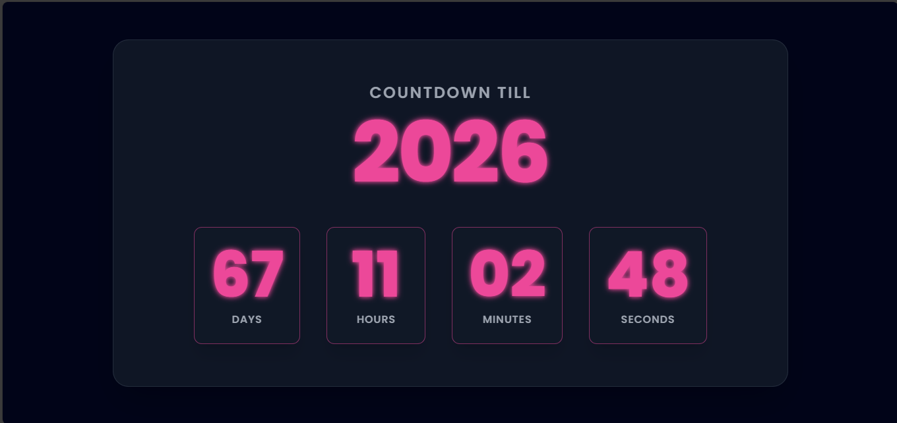

# 🚀 New Year 2026 Countdown

This is a visually stunning, responsive countdown timer built to mark the arrival of January 1, 2026. It features a cosmic dark theme with a vibrant Neon Pink glow effect on the numbers, created using vanilla JavaScript and Tailwind CSS.

## 📸 Screenshot

Here is a preview of the countdown timer's design:



## ✨ Features

* **⚡️ Live Clock:** Accurate, real-time countdown calculation using JavaScript.
* **🌌 Cosmic Design:** Deep, high-contrast radial gradient background.
* **💖 Neon Numbers:** Sharp, glowing pink digits using custom CSS shadows for a festive look.
* **📱 Fully Responsive:** Optimized layout for all screen sizes (desktop, tablet, mobile).
* **🎉 Expiry Message:** Displays a "Happy New Year!" message when the timer hits zero.

## 🛠️ Tech Stack

* **HTML5:** For the page structure.
* **Tailwind CSS (CDN):** For utility-first, modern styling and responsiveness.
* **JavaScript (Vanilla):** Handles the time calculation and DOM updates.

## 💡 Local Setup

To run this project on your local machine:

1.  **Clone the repository:**
    ```bash
    git clone [https://github.com/ankitab78/New-Year-Countdown.git](https://github.com/ankitab78/New-Year-Countdown.git)
    ```
2.  **Navigate to the folder:**
    ```bash
    cd New-Year-Countdown
    ```
3.  Open the `index.html` file in your web browser.

---

## 🔗 Live Demo

You can view the live countdown project here (once GitHub Pages is enabled):

[https://ankitab78.github.io/New-Year-Countdown/](https://ankitab78.github.io/New-Year-Countdown/)

---
**Happy New Year Coding! 🥳**
